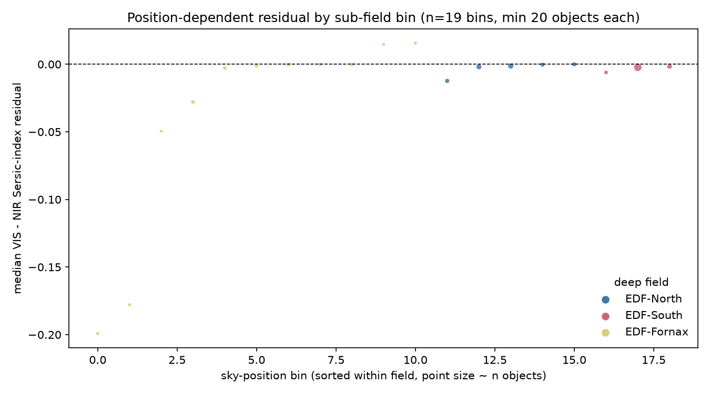
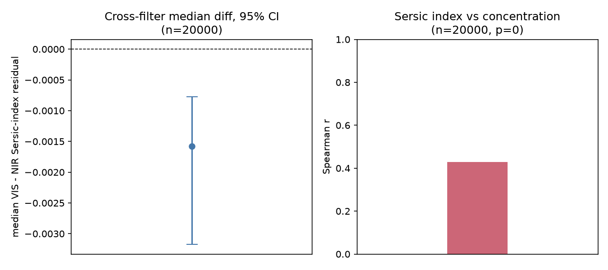

# Euclid Q1 Morphology Measurement Comparison

[](https://github.com/Biswajit1999/euclid-morphology-consistency/actions/workflows/ci.yml)
[](LICENSE)

How consistent are real Euclid Q1 galaxy morphology measurements across
filters and measurement methods, and where should users trust or distrust
them?

This project audits consistency between measurements the official Euclid
pipeline already produced for the same real Q1 objects -- VIS-band vs.
NIR-band single-Sersic fits, and the parametric Sersic index vs. the
independently computed non-parametric CAS concentration statistic -- using
live queries to the public IRSA TAP service. It is a companion to (and
does not duplicate) this author's `euclid-star-shapes` (PSF/astrometry)
and `euclid-spectra-quality` (spectral contamination) audits.

## Quickstart

```bash
git clone https://github.com/Biswajit1999/euclid-morphology-consistency.git
cd euclid-morphology-consistency
python -m pip install -e ".[dev]"

pytest -q                                   # 14 tests, fixture-based, no network
euclidmorph run --out results/default --n 20000
```

## Result




On **20,000 real, quality-flagged Euclid Q1 objects**
(`results/default/summary.json`, generated by `euclidmorph run`):
VIS-vs-NIR Sersic index shows a **statistically significant but
practically negligible population-level bias** -- the median difference
is -0.00129 (95% bootstrap CI [-0.00261, -0.00060], excludes zero;
Wilcoxon signed-rank p=4.9e-14) -- roughly **552x smaller** than the
per-object scatter (MAD=0.713). An earlier version of this README called
this "no population-level bias" from the point estimate alone, with no
uncertainty interval or significance test; an external review (Codex)
flagged that as stronger than the analysis supported, so both the CI and
the significance test are now reported alongside the effect size, and the
reader can judge "statistically real but tiny" for themselves rather than
take a bare "no bias" on faith. Per-object correlation is only **weak**
(Pearson r=0.209). The parametric Sersic index and the non-parametric CAS
concentration statistic show a **moderate positive correlation**
(Spearman r=0.424), consistent with both capturing related morphological
information.

**A genuine, catalog-wide finding**: the official Q1 catalog's
two-component bulge+disk Sersic fit is **entirely unpopulated** (NULL for
all 29,953,430 rows) -- confirmed via a live `COUNT` query with no
selection bias, not a bug in this project. This changed the project's
planned cross-method comparison mid-development; see
`docs/DATA_SOURCES.md`.

## What this is not

- Not an independent re-measurement of galaxy morphology -- this audits
  consistency between official-pipeline outputs only.
- Not a claim that either VIS or NIR (or Sersic index vs. concentration)
  is "more correct."
- Not a duplicate of `euclid-star-shapes` (PSF) or `euclid-spectra-quality`
  (spectral contamination) -- distinct, non-overlapping questions.
- Not affiliated with or endorsed by the Euclid Consortium, ESA, or IRSA.

## Repository layout

```
src/euclidmorph/   IRSA TAP adapter, consistency analysis, CLI
scripts/            make_figures.py, regenerates results/figures/ from committed results/
tests/              12 tests (real-excerpt- and synthetic-data-based) + 3 live-network tests
docs/                METHODS, DATA_SOURCES, LIMITATIONS, REPRODUCIBILITY, VALIDATION, CLAIMS
```

## Citation

See `CITATION.cff`.

## Contributing

See `CONTRIBUTING.md`.

## Acknowledgments

See `ACKNOWLEDGMENTS.md`.
