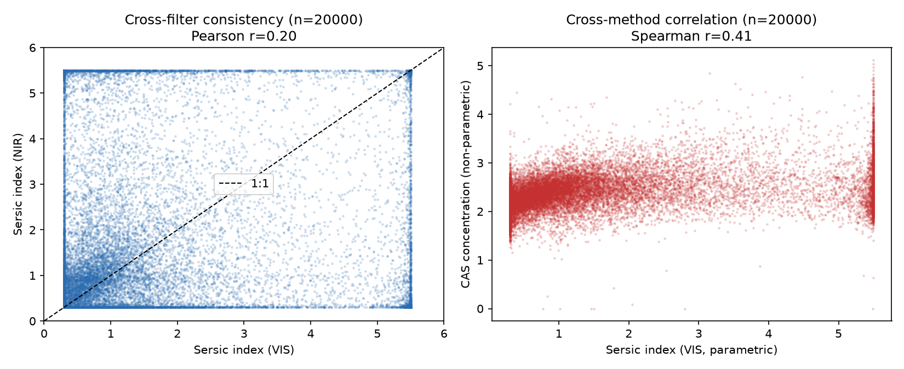

# Euclid Q1 Morphology Consistency Audit

[](https://github.com/Biswajit1999/euclid-morphology-consistency/actions/workflows/ci.yml)
[](LICENSE)

How consistent are real Euclid Q1 galaxy morphology measurements across
filters and measurement methods, and where should users trust or distrust
them?

This project audits consistency between measurements the official Euclid
pipeline already produced for the same real Q1 objects -- VIS-band vs.
NIR-band single-Sersic fits, and the parametric Sersic index vs. the
independently computed non-parametric CAS concentration statistic -- using
live queries to the public IRSA TAP service. It is a companion to (and
does not duplicate) this author's `euclid-star-shapes` (PSF/astrometry)
and `euclid-spectra-quality` (spectral contamination) audits.

## Quickstart

```bash
git clone https://github.com/Biswajit1999/euclid-morphology-consistency.git
cd euclid-morphology-consistency
python -m pip install -e ".[dev]"

pytest -q                                   # 9 tests, fixture-based, no network
euclidmorph run --out results/ --n 20000
```

## Result



On **20,000 real, quality-flagged Euclid Q1 objects**
(`results/default/summary.json`, generated by `euclidmorph run`):
VIS-vs-NIR Sersic index shows **no population-level bias** (median
difference ~0) but only **weak per-object correlation** (Pearson r=0.20)
-- individual measurements for the same galaxy often disagree
substantially even though there's no systematic filter offset. The
parametric Sersic index and the non-parametric CAS concentration
statistic show a **moderate positive correlation** (Spearman r=0.41),
consistent with both capturing related morphological information.

**A genuine, catalog-wide finding**: the official Q1 catalog's
two-component bulge+disk Sersic fit is **entirely unpopulated** (NULL for
all 29,953,430 rows) -- confirmed via a live `COUNT` query with no
selection bias, not a bug in this project. This changed the project's
planned cross-method comparison mid-development; see
`docs/DATA_SOURCES.md`.

## What this is not

- Not an independent re-measurement of galaxy morphology -- this audits
  consistency between official-pipeline outputs only.
- Not a claim that either VIS or NIR (or Sersic index vs. concentration)
  is "more correct."
- Not a duplicate of `euclid-star-shapes` (PSF) or `euclid-spectra-quality`
  (spectral contamination) -- distinct, non-overlapping questions.
- Not affiliated with or endorsed by the Euclid Consortium, ESA, or IRSA.

## Repository layout

```
src/euclidmorph/   IRSA TAP adapter, consistency analysis, CLI
tests/              9 tests (real-excerpt-based) + 1 live-network test
docs/                METHODS, DATA_SOURCES, LIMITATIONS, REPRODUCIBILITY, VALIDATION, CLAIMS
```

## Citation

See `CITATION.cff`.

## Contributing

See `CONTRIBUTING.md`.

## Acknowledgments

See `ACKNOWLEDGMENTS.md`.
